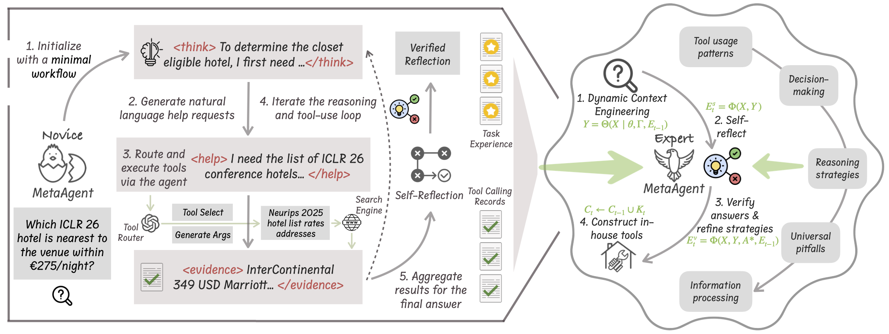

# 
MetaAgent: Toward Self-Evolving Agent via Tool Meta-Learning

<strong>Learning by Doing: From Novice to Expert!</strong>

<h4 align="center">

<a href="#rocket-infrastructure">Infrastructure</a> |
<a href="#notebook-quick-start">Quick-Start</a> |
<a href="#raised_hands-faqs"> FAQs</a> 

## Overview
MetaAgent is a next-generation agentic AI framework built on the principle of learning-by-doing: expertise is developed through hands-on practice and continual self-improvement, not through static rules or costly retraining. MetaAgent begins with a minimal workflow, equipped only with essential reasoning and adaptive help-seeking capabilities. When encountering knowledge gaps, it generates natural language help requests, which are flexibly routed to external tools by a dedicated tool router.

As MetaAgent solves tasks, it performs ongoing self-reflection and answer verification, turning experience into concise, generalizable lessons that are dynamically integrated into future tasks. Over time, MetaAgent autonomously builds in-house tools and a persistent knowledge base by organizing its tool-use history—enabling ever more efficient information retrieval and integration.
We call this continual, data-driven improvement process meta tool learning. Unlike traditional agentic systems, MetaAgent evolves and adapts on-the-fly—without changing model weights or needing additional training.

## :sparkles: Features

## :rocket: Infrastructure

## :notebook: Quick Start

## :raised_hands: FAQs

